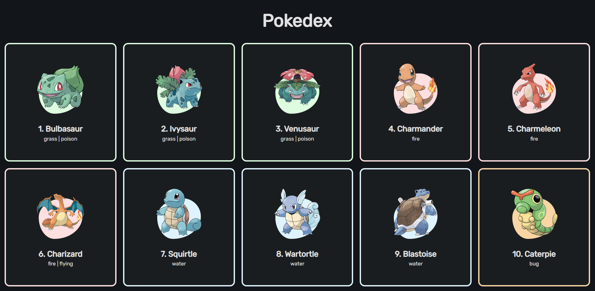

<h1 align="center">
Pokedex JS
</h1>



## 🔎 Sobre o Projeto

O Pokédex JS é uma aplicação web que tem como objetivo mostrar uma lista de Pokémons e suas tipagens. O projeto foi desenvolvido com o propósito de ensinar métodos de aplicações utilizando de JavaScript puro, focando principalmente no consumo e tratamento de informações provenientes de uma API.

## ⚙ Tecnologias Utilizadas

- <a target="_blank" href="https://pokeapi.co">PokéAPI</a>
- <a target="_blank" href="https://github.com/cure53/DOMPurify">DOMPurify</a>

## ✨ Como executar o projeto

1. Faça um clone do repositório

```bash
  $ git clone https://github.com/RafaelMotaAlvess/Pokedex-JS.git
```

2. Execute o arquivo <span style='color: cyan; font-weight: bold;'>index.html</span> no navegador.

---

<h3>Este projeto foi desenvolvido com a orientação de <a target="_blank" href="https://github.com/Roger-Melo">Roger Melo</a></h3>
